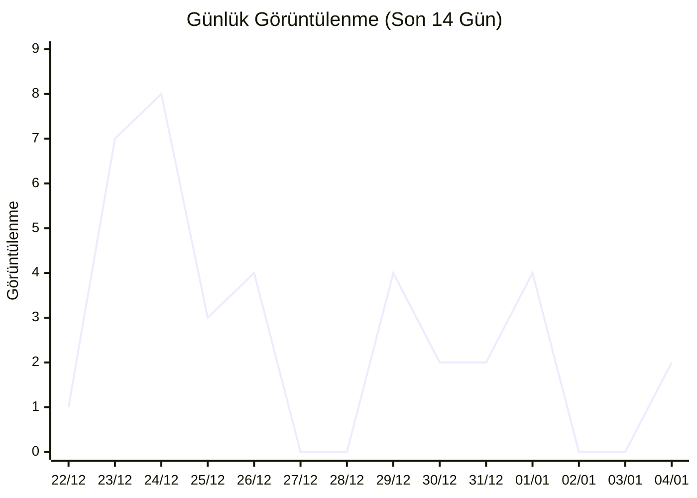
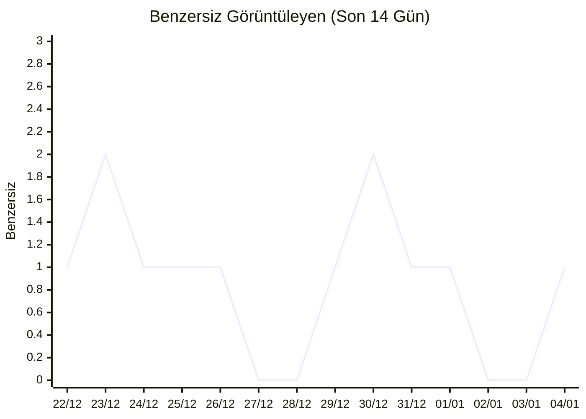
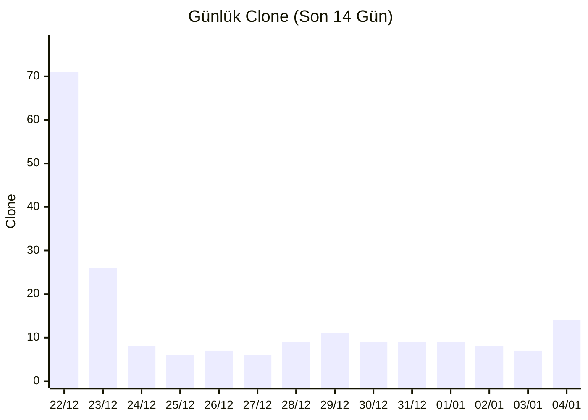

# EPINT - EPİAŞ API Python Client

EPİAŞ API'lerine erişim sağlayan Python kütüphanesi.

## Kurulum

EPINT henüz PyPI'da yayınlanmadığı için GitHub'dan kurulum yapabilirsiniz:

```bash
pip install git+https://github.com/metehanboy/epint.git
```

veya geliştirme modunda:

```bash
pip install -e git+https://github.com/metehanboy/epint.git#egg=epint
```

Kurulumdan sonra:

```python
import epint as ep
```

## Kimlik Doğrulama

API'ye erişim için kullanıcı adı ve şifre ayarlanmalıdır:

```python
ep.set_auth("username", "password")
ep.set_mode("prod")  # veya "test"
```

## Kullanım

### Detaylı Kullanım Örnekleri

Belirli servisler için detaylı kullanım örnekleri ve açıklamalar:

- **[Wiki: Profil Katsayıları Rehberi](https://github.com/metehanboy/epint/wiki/Examples/Profile-Coefficients)**: Profil katsayıları hakkında detaylı wiki rehberi (Examples alt sayfası)
- **...

### Temel Yapı

```python
ep.[kategori].[method_adi](parametreler)
```

### Kategoriler

#### Şeffaflık (Seffaflik) Kategorileri

- **`seffaflik_electricity`** veya **`transparency`**: Elektrik şeffaflık verileri
- **`seffaflik_natural_gas`** veya **`naturalgas`**, **`cng`**, **`dogalgaz`**: Doğalgaz şeffaflık verileri
- **`seffaflik_reporting`** veya **`reporting`**: Raporlama verileri

#### Uzlaştırma (Reconciliation) Kategorileri

- **`reconciliation_invoice`** veya **`invoice`**: Fatura uzlaştırma
- **`reconciliation_bpm`** veya **`bpm`**: BPM uzlaştırma
- **`reconciliation_imbalance`** veya **`imbalance`**: Dengesizlik uzlaştırma
- **`reconciliation_market`** veya **`market`**: Piyasa uzlaştırma
- **`reconciliation_mof`** veya **`mof`**: MOF uzlaştırma
- **`reconciliation_res`** veya **`res`**: RES uzlaştırma
- **`pre_reconciliation`**: Ön uzlaştırma

#### Diğer Kategoriler

- **`gop`**: GOP servisleri
- **`customer`**: Müşteri servisleri
- **`demand`**: Talep servisleri
- **`grid`**: Şebeke servisleri
- **`registration`**: Kayıt servisleri
- **`balancing_group`**: Dengeleme grubu servisleri
- **`gunici`**: Gün içi servisleri
- **`gunici_trading`**: Gün içi ticaret servisleri

## Örnekler

### Temel Kullanım

```python
# Elektrik şeffaflık verileri
result = ep.seffaflik_electricity.mcp_data(
    start='2025-12-10',
    end='2025-12-11'
)

# Doğalgaz şeffaflık verileri
result = ep.seffaflik_natural_gas.consumer_count_export(
    period='2025-10-01',
    export_type='XLSX'
)
```

### Parametre Kullanımı

#### Tarih Parametreleri

Tarih parametreleri string veya datetime objesi olarak verilebilir:

```python
from datetime import datetime

# String format
ep.seffaflik_electricity.mcp_data(start='2025-12-10', end='2025-12-11')

# Datetime format
ep.seffaflik_electricity.mcp_data(
    start=datetime(2025, 12, 10),
    end=datetime(2025, 12, 11)
)
```

#### Sayfalama (Pagination)

Sayfalama parametreleri otomatik olarak varsayılan değerlerle doldurulur:

```python
# Varsayılan: page={'number': 1, 'size': 1000}
result = ep.customer.customer_list()

# Özel sayfalama
result = ep.customer.customer_list(page={'number': 2, 'size': 100})
```

#### Bölge Parametreleri

Bölge parametreleri otomatik olarak varsayılan değerlerle doldurulur:

```python
# Varsayılan: region='TR1'
result = ep.demand.demand_forecast()

# Özel bölge
result = ep.demand.demand_forecast(region='TR2')
```

### Binary Response'lar (XLSX, PDF)

Export metodları binary format (XLSX, PDF) döndürür. Bu response'lar `io.BytesIO` objesi olarak döndürülür:

```python
# XLSX export
xlsx_data = ep.seffaflik_electricity.consumer_count_export(
    period='2025-10-01',
    export_type='XLSX'
)

# BytesIO objesi olarak döndürülür
with open('export.xlsx', 'wb') as f:
    f.write(xlsx_data.read())
```

### Fuzzy Matching

Method isimleri fuzzy matching ile bulunur, yani küçük yazım hataları tolere edilir:

```python
# Bu çağrılar aynı sonucu verir
ep.seffaflik_electricity.mcp_data(...)
ep.seffaflik_electricity.mcpData(...)
ep.seffaflik_electricity.mcp_data(...)
```

### Kategori Alias'ları

Bazı kategoriler için kısa alias'lar mevcuttur:

```python
# Aynı kategori
ep.transparency.mcp_data(...)  # seffaflik_electricity
ep.naturalgas.mcp_data(...)    # seffaflik_natural_gas
ep.invoice.list(...)           # reconciliation_invoice
ep.bpm.list(...)               # reconciliation_bpm
```

## Özellikler

### Otomatik Parametre Dönüşümü

- **Tarih formatları**: String veya datetime objeleri otomatik olarak ISO formatına dönüştürülür
- **Sayısal formatlar**: Integer ve float değerler otomatik olarak doğru formata dönüştürülür
- **CamelCase/Snake_case**: Parametre isimleri otomatik olarak eşleştirilir

### Response İşleme

- **JSON Response'lar**: Otomatik olarak parse edilir ve schema'ya göre dönüştürülür
- **Binary Response'lar**: XLSX, PDF gibi binary içerikler `io.BytesIO` olarak döndürülür
- **RestResponse Wrapper**: RestResponse yapısındaki response'larda `body` otomatik olarak çıkarılır

### Hata Yönetimi

Hatalar otomatik olarak yakalanır ve detaylı hata mesajları gösterilir:

```python
try:
    result = ep.seffaflik_electricity.mcp_data(start='2025-12-10', end='2025-12-11')
except Exception as e:
    print(f"Hata: {e}")
```

## Method Bilgisi Görüntüleme

Endpoint objesini çağırmadan önce bilgilerini görmek için:

```python
# Endpoint bilgilerini görüntüle
print(ep.seffaflik_electricity.mcp_data)
```

Bu komut şunları gösterir:
- Method ve path bilgisi
- Parametreler ve tipleri
- Response yapısı
- Örnek değerler


## 📊 İstatistikler

### Repository İstatistikleri

- ⭐ **Stars**: 2
- 🍴 **Forks**: 1
- 👀 **Watchers**: 2
- 🐛 **Open Issues**: 0

### 📈 Trafik İstatistikleri

- 👁️ **Toplam Görüntülenme**: 37
- 👤 **Benzersiz Görüntüleyen**: 3
- 📥 **Toplam Clone**: 200
- 📥 **Benzersiz Clone**: 65
- 📊 **Son 7 Gün Görüntülenme**: 14
- 📊 **Son 7 Gün Benzersiz**: 6
- 📅 **Son Gün Görüntülenme**: 2
- 📅 **Son Gün Benzersiz**: 1
- 📊 **Son 7 Gün Clone**: 67
- 📊 **Son 7 Gün Clone (Benzersiz)**: 26
- 📅 **Son Gün Clone**: 14
- 📅 **Son Gün Clone (Benzersiz)**: 6

**En Popüler Sayfalar:**
  1. `/metehanboy/epint/wiki/Examples` - 8 görüntülenme (1 benzersiz)
  2. `/metehanboy/epint` - 6 görüntülenme (2 benzersiz)
  3. `/metehanboy/epint/tree/main/src/epint/endpoints` - 6 görüntülenme (1 benzersiz)
  4. `/metehanboy/epint/commits/main` - 5 görüntülenme (1 benzersiz)
  5. `/metehanboy/epint/blob/main/src/epint/endpoints/seffaflik-electricity/swagger.json` - 4 görüntülenme (1 benzersiz)

**En Popüler Referanslar:**
  1. `github.com` - 33 (1 benzersiz)
  2. `statics.teams.cdn.office.net` - 2 (2 benzersiz)

#### 📊 Görüntülenme Grafikleri






#### 📥 Clone Grafikleri




### Pull Request İstatistikleri

- 📝 **Toplam PR**: 1
- ✅ **Açık PR**: 0
- 🔒 **Kapalı PR**: 1
- 🔀 **Birleştirilmiş PR**: 1

### Katkıda Bulunanlar

- [metehanboy](https://github.com/metehanboy) (74 katkı)
- [farukkornaz](https://github.com/farukkornaz) (1 katkı)
## Notlar

- İlk kullanımda kategori otomatik olarak yüklenir
- Authentication bilgileri her endpoint çağrısında kontrol edilir
- Test modunda test sunucularına, prod modunda production sunucularına bağlanılır
- GOP servisleri için özel authentication mekanizması kullanılır
